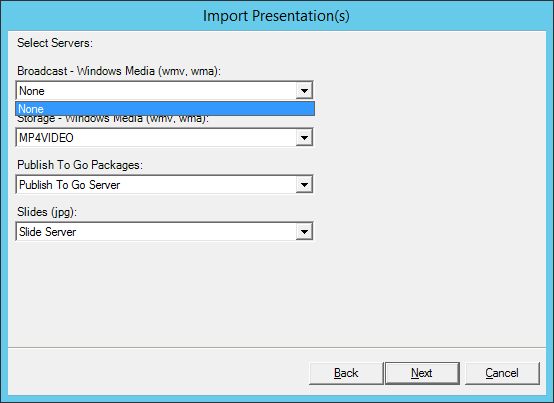
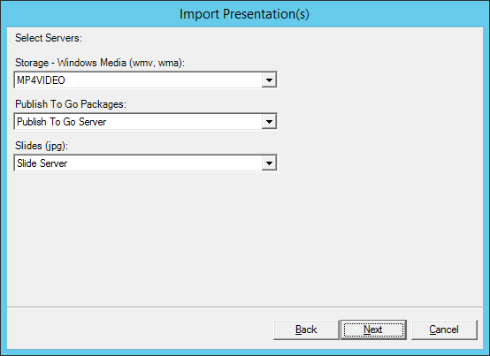

# live-content-import-fix \[[Mediasite Video Platform](http://www.sonicfoundry.com/mediasite/)\]

Update Mediasite Presentation XML files with **IsLive** set to false and **LiveStatus** set to 0 to not to import [Live Content](https://msdn.microsoft.com/en-us/library/ff723875(v=expression.40).aspx) altogether with the presentation.

* It does nothing to the original media

See the screenshots below.

_BEFORE_

_AFTER_

## DOWNLOAD

[v0.1.0](https://github.com/paveljurca/import_fix/releases/tag/v0.1.0)

## SYNOPSIS

`import_fix.exe --live IMPORT_DIR IMPORT_DIR IMPORT_DIR [...]`

## USAGE

Wrap calls in a loop to surpass the [command-line string length limitation](https://support.microsoft.com/en-us/help/830473/command-prompt-cmd--exe-command-line-string-limitation) (8191 characters):

    for /d %f in ("IMPORT_FOLDERS\*") do @import_fix.exe --live "%~ff" >>fixed.txt

## ABOUT

Windows Server 2012 dropped support for [Windows Media Server](https://msdn.microsoft.com/en-us/library/cc239490.aspx)
and [streaming over `MMS://`](https://docs.microsoft.com/en-us/iis/media/windows-media-services/windows-media-server-or-web-server) respectively.
They had switched to [Live Smooth Streaming](https://technet.microsoft.com/en-us/library/ee791818(v=ws.10).aspx).
The Mediasite **Broadcast — Windows Media (wmv, wma)** content server can't be set up any more.

*Sonic Foundry suggest a downgrade to Windows Server 2008, but unless you are going to import
Live Content presentations originating from previous Mediasite Server versions you are all good.*

But we were not.

## CODE

**Does not support zipped packages (unzip them first).**

* [Why is it such a bad idea to parse XML with regex](https://stackoverflow.com/questions/8577060/why-is-it-such-a-bad-idea-to-parse-xml-with-regex) and why it is not
* Built with [Perl2Exe](http://www.indigostar.com/perl2exe.php)
* _IDE_ Microsoft Notepad :))

## LICENSE

Released into the public domain.

## DISCLAIMER

Don't blame me.
